# June 18: Started project and schematic

I discovered today that the pendant YSWS ends today (tomorrow my timezone), so I quickly thought of something I could rush in that timeframe. I had been working on a 32x8 bicolor matrix module, which is just 4 modules combined into a board. After looking at the pendant homepage, I got inspired by the example and decided to make a pendant similar to that but with a three colour display instead (red, orange, green). I thought of using 1 pcb for the entire thing, but that likely wasn't possible as 2 layers was mostly needed for the matrix routing and address selection. So, I decided to go with the same method of having an adapter board with a controller. It would be pretty cool to have an orange fire pattern.

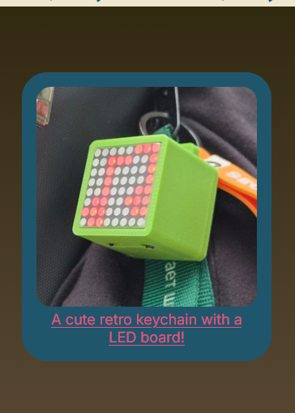
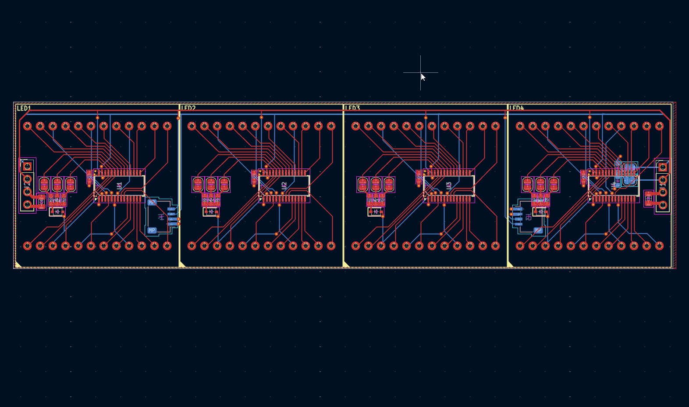

I mostly worked on the schematic, trying to get all the components in and routed. I browsed WEBENCH for a good boost converter to use, since the display needed 5V to operate (green LEDs, not really reliable with VBAT supply for a lipo cell). Although I would need 2 different boards, separating them into their own schematic would be fairly easy. I wanted to focus my attention onto getting everything connected and assign footprints.

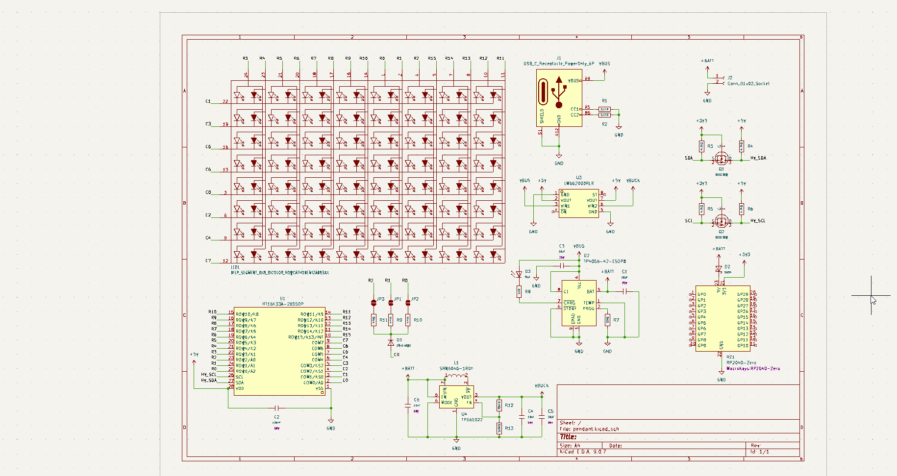

Total time spent: 2.5 hours

# June 19: Split into two PCBs and started layout

I began the day by separating the project into 2 pcbs, the matrix module and the pendant controller. The PCB was just a matter of copying the traces and vias from my 32x8 matrix and adjusting a few traces and vias to fit the new board. Overall, it took about 1.5hrs to complete this section.
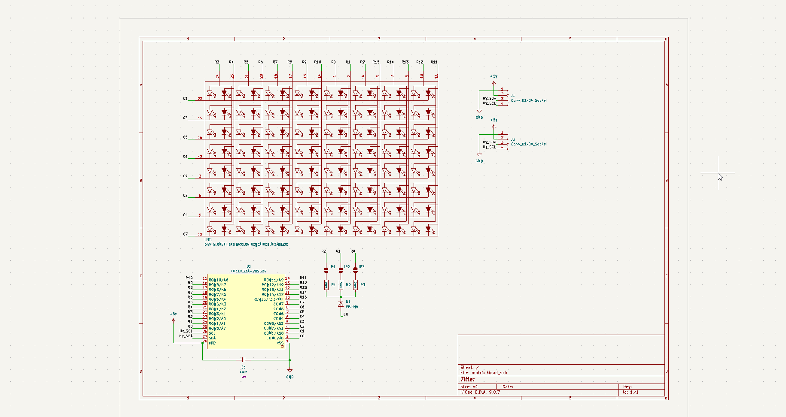
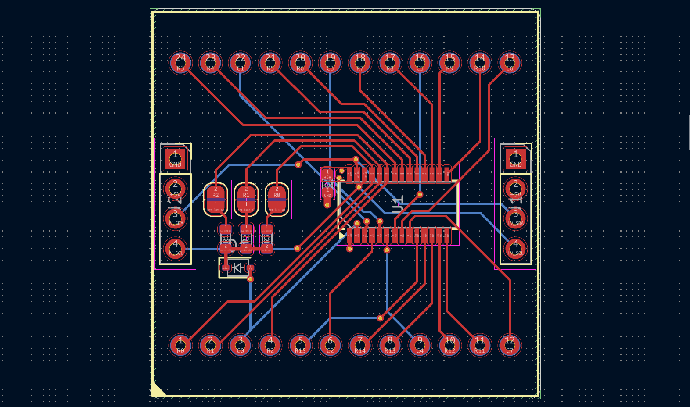

However, the challenge came when I tried to import the changes into PCB for the pendant controller. I originally wanted to use a RP2040 Zero (the one without the USB connector), since it could be surface mounted without a bottom cutout on the board. However, it seems like this won't be possible with my board size. 

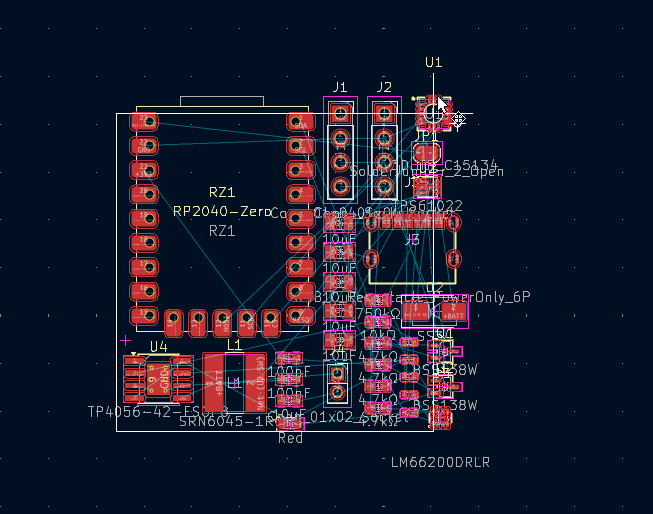

I wanted a small but simple solution, since I didn't want to spend too much time on this project. I thought back to the Arduino modulino modules which I had looked at a while ago. They're quite comical to me, especially the button and buzzer modules, which literally use a STM32 microcontroller to breakout 4 buttons and 1 buzzer respectively over I2C. They use the STM32C011, which is a very small microcontroller that doesn't need any external components other than decoupling capacitors. This would be too small for my application, since I wanted to use Arduino IDE and heavy Adafruit GFX libraries (along with STM32 Arduino Core). So, I settled with STM32C071. After finishing, I started working on the boost converter layout:

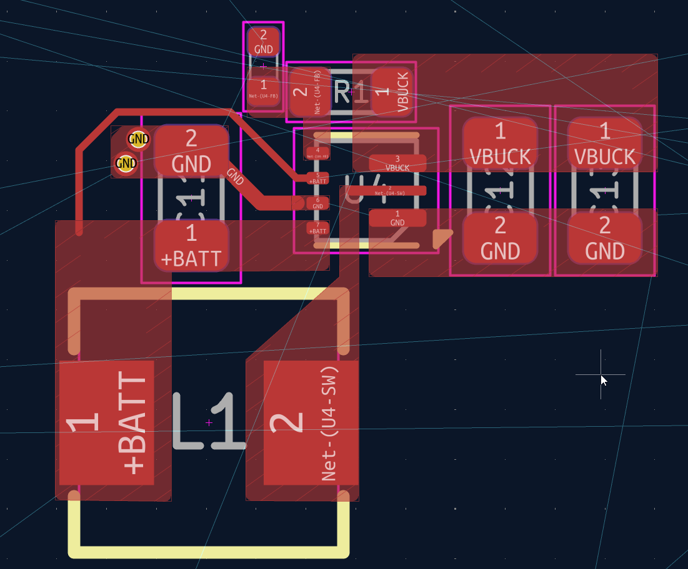

This took a while since I kept having to adjust the clearance to keep the routing possible to what the datasheet recommended. I ended up with 0.2mm clearance from track/pour to pad, which is quite tight but should be fine.

As I was laying out the components and talking to a friend, they asked if what I was making was one of those particle motion simulation display matrices. I sent him a video of one a while ago, so I guess he thought it was that. This gave me the inspo to add an accelerometer to the controller, so I spent ~20 mins searching for an accelerometer. I initially thought of LIS2DW12, but it's  only under standard assembly. Thankfully, LIS3DH is under economic, so I went with that. 

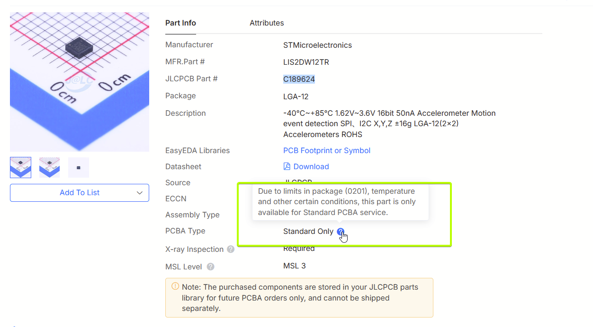

Progress after laying out the components and some routing:

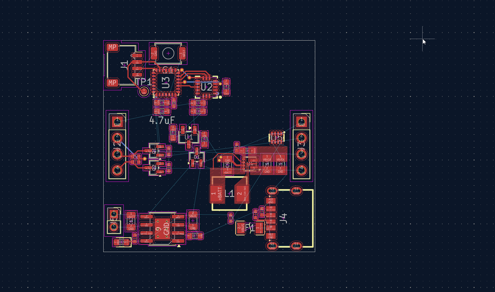

Although it's now past the Pendant deadline, I wanted to finish this, and it gave me more motivation to spend time polishing the routing. 

Total time spent: 5 hours

# June 20: Finished routing and cleaned up schematic

I very much locked in on the routing and spent a few hours getting everything pretty much finished. 

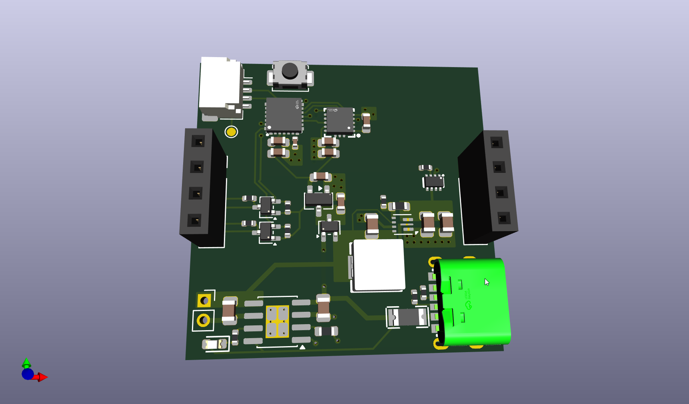

DRC had a few errors about the USB C port, although most were about the footprint of the QFN-28 4x4 footprint from JLC. I just decided to ignore them for now, since it should be fine and within JLC tolerances (esp since it's the JLC footprint). 

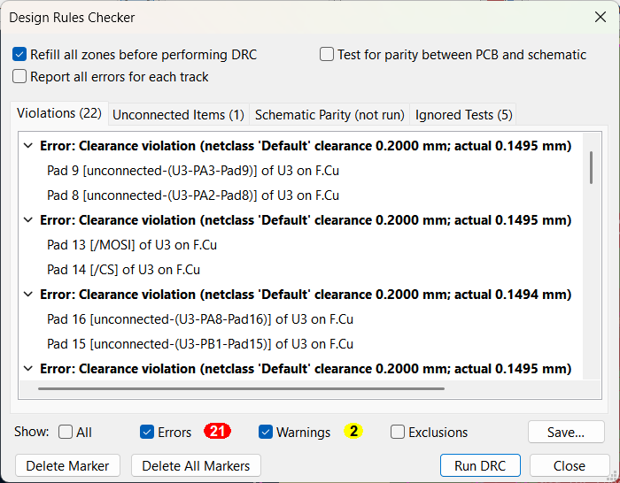

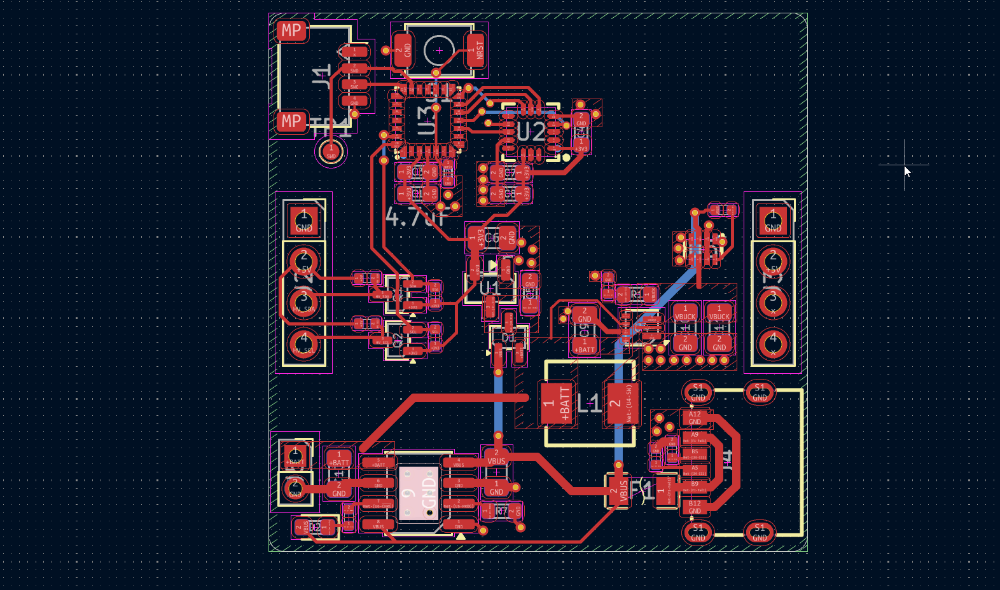

Finally, I spent some time cleaning up the schematic:

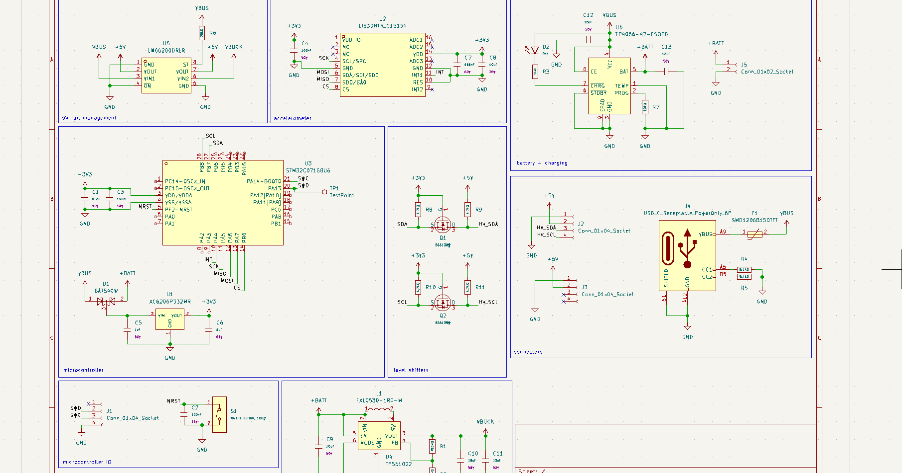

Total time spent: 4 hours

# June 24: Revision of power management system

Looking at my circuit again, I realized a small (not that small) flaw. Since I choose the LM66200, which is a dual ideal diode, it would always select the input from the higher voltage input. Since I am only using standard components for my resistors, I'm using a 750k resistor currently for my feedback resistor, resulting in 5.1V output. This would mean that the USB would never actually power anything. I thought of using the TPS2116 instead, which is the same IC but is a dual input MUX, but I just figured I could just have the USB input (VBUS) turn off the boost converter, and add a diode on the USB input to prevent reverse current. This is what I decided to go with, and made the quick adjustments:

Enbale circuit for the boost converter (EN high, so used a N-MOSFET)
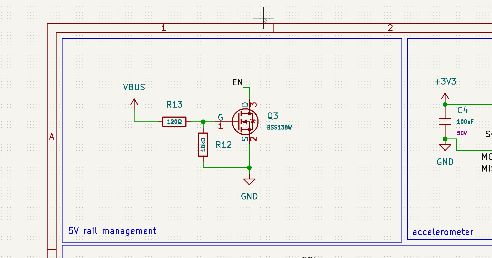

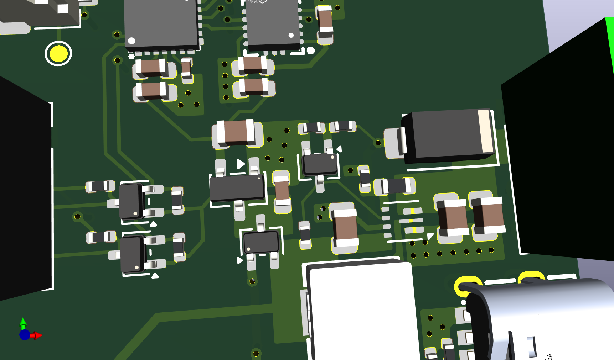

Total time spent: 2 hours
