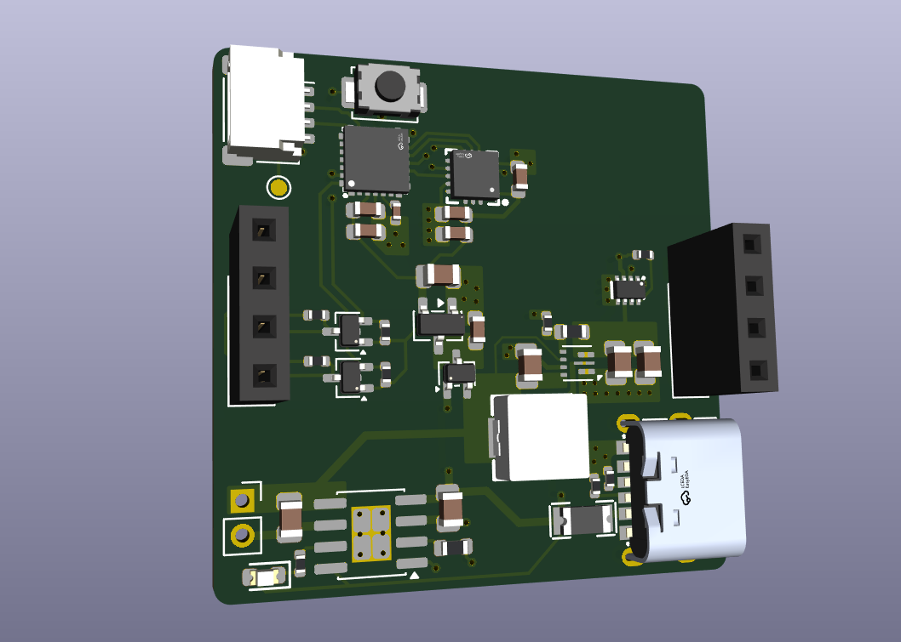
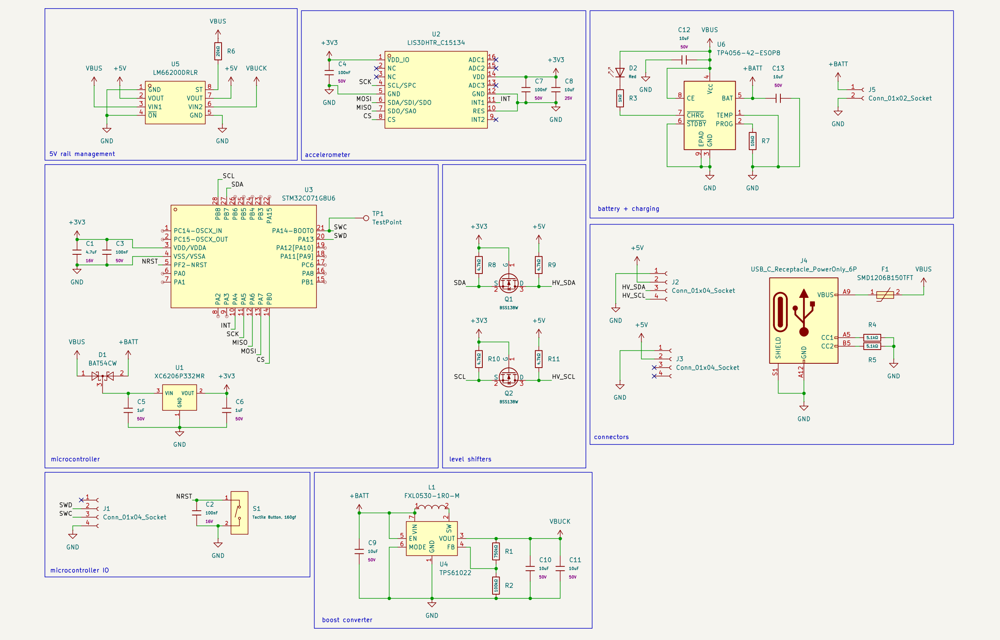
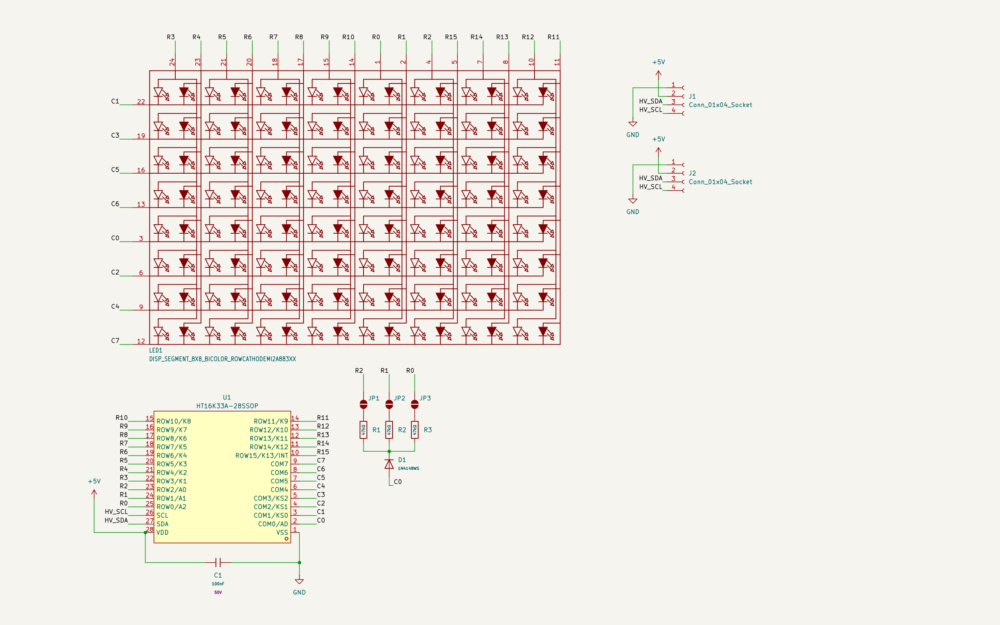

# Tri-color LED Pendant

A pendant built from two PCBs: a 8×8 bicolor LED matrix module (red, orange, green) and controller board with battery charging, USB-C power, 5 V boost, and motion sensing.

## Why I made this

I had already been working on a 32×8 bicolor matrix module and wanted to try the Pendant YSWS before the deadline. An example on the pendant website inspired me to make a bicolor version with an orange fire-style pattern. Fitting the full matrix and controller on one 2/4 layer board was not the most possible, so my design splits into a display PCB and a pendant controller, which are connected with 2.54mm pitch pin headers (likely just male machine pin headers soldered on both sides, since they have a larger spacing to accomodate for the inductor). There is also an accelerometer to have potential particle motion simulation.

## Photos

### 3D model

Full KiCad 3D render of the controller board with all SMD parts populated:

### Schematic

**Controller**

**Matrix**

### PCB layouts

**Controller board**

**Matrix module**

## Connections

All signals between the two boards are carried on PCB-mounted 2.54 mm pin headers. No off-board wiring is required beyond a LiPo cell on the controller.

## Bill of materials

Prices are per-unit LCSC values; standard connector values are estimated.

### Controller PCB

| Ref | Qty | Value | LCSC | Unit | Extended |
|-----|-----|-------|------|------|----------|
| U3 | 1 | STM32C071G8U6 | C44521811 | $1.67 | $1.67 |
| U4 | 1 | TPS61022 | C915088 | $1.32 | $1.32 |
| U2 | 1 | LIS3DHTR | C15134 | $1.20 | $1.20 |
| U1 | 1 | XC6206P332MR | C5446 | $0.102 | $0.10 |
| U6 | 1 | TP4056-42-ESOP8 | C16581 | $0.19 | $0.19 |
| U5 | 1 | LM66200DRLR | C3235556 | $0.45 | $0.45 |
| L1 | 1 | FXL0530-1R0-M | C475517 | $0.17 | $0.17 |
| Q1, Q2 | 2 | BSS138W | C28646265 | $0.025 | $0.05 |
| D1 | 1 | BAT54CW | C22392482 | $0.035 | $0.04 |
| D2 | 1 | Red LED | C2286 | $0.009 | $0.01 |
| F1 | 1 | SMD1206B150TFT | C269120 | $0.03 | $0.03 |
| S1 | 1 | Tactile button | C720477 | $0.053 | $0.05 |
| J4 | 1 | USB-C receptacle | C18357552 | $0.08 | $0.08 |
| J1 | 1 | JST-SH 4-pin | - | $0.08 *(est.)* | $0.08 |
| J2, J3 | 2 | 4-pin pin socket | - | $0.05 *(est.)* | $0.10 |
| J5 | 1 | 2-pin pin socket | - | $0.03 *(est.)* | $0.03 |
| C9–C13 | 5 | 10 µF | C440198 | $0.069 | $0.35 |
| C1 | 1 | 4.7 µF | C19666 | $0.014 | $0.01 |
| C8 | 1 | 10 µF | C96446 | $0.021 | $0.02 |
| C3, C4, C7 | 3 | 100 nF | C14663 | $0.006 | $0.02 |
| C5 | 1 | 1 µF | C15849 | $0.008 | $0.01 |
| C6 | 1 | 1 µF | C28323 | $0.012 | $0.01 |
| C2 | 1 | 100 nF | C1525 | $0.004 | $0.00 |
| R10–R11, R8–R9 | 4 | 4.7 kΩ | C25900 | $0.004 | $0.02 |
| R4, R5 | 2 | 5.1 kΩ | C25905 | $0.004 | $0.01 |
| R1 | 1 | 750 kΩ | C23240 | $0.004 | $0.00 |
| R2 | 1 | 100 kΩ | C25741 | $0.004 | $0.00 |
| R3 | 1 | 1 kΩ | C11702 | $0.004 | $0.00 |
| R6 | 1 | 20 kΩ | C25765 | $0.004 | $0.00 |
| R7 | 1 | 10 kΩ | C25804 | $0.004 | $0.00 |

**Controller subtotal: $6.24**

### Matrix PCB

| Ref | Qty | Value | LCSC | Unit | Extended |
|-----|-----|-------|------|------|----------|
| U1 | 1 | HT16K33A-28SSOP | C5444738 | $0.50 | $0.50 |
| LED1 | 1 | 8×8 bicolor LED matrix | - | $1.50 *(est.)* | $1.50 |
| R1–R3 | 3 | 47 kΩ | C25819 | $0.004 | $0.01 |
| C1 | 1 | 100 nF | C14663 | $0.006 | $0.01 |
| D1 | 1 | 1N4148WS | C2128 | $0.012 | $0.01 |
| J1, J2 | 2 | 4-pin pin socket | - | $0.05 *(est.)* | $0.10 |

**Matrix subtotal: $2.13**

### Total component cost

| Board | Subtotal |
|-------|----------|
| Controller | $6.24 |
| Matrix | $2.13 |
| **Grand total (1× each board)** | **$8.37** |

